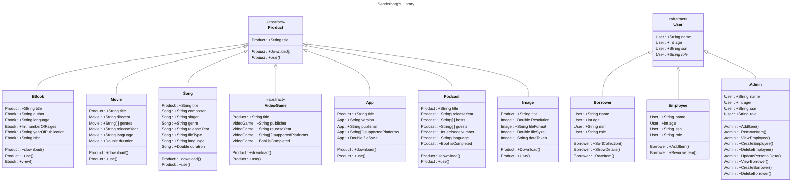

```mermaid

---
title: Sønderborg’s Library
---
classDiagram

    class Product {
        <<abstract>>
        Product : +String title
        Product : +download()*
        Product : +use()*
    }

    class EBook {
        Product : +String title
        Ebook   : +String author
        Ebook   : +String language
        Ebook   : +Int numberOfPages
        Ebook   : +String yearOfPublication
        Ebook   : +String isbn
        Product : +download()
        Product : +use()
        Ebook   : +view()
    }

    class Movie {
        Product : +String title
        Movie   : +String director
        Movie   : +String[ ] genres
        Movie   : +String releaseYear
        Movie   : +String language
        Movie   : +Double duration
        Product : +download()
        Product : +use()
    }

    class Song {
        Product : +String title
        Song    : +String composer
        Song    : +String singer
        Song    : +String genre
        Song    : +String releaseYear
        Song    : +String fileType
        Song    : +String language
        Song    : +Double duration
        Product : +download()
        Product : +use()
    }

    class VideoGame {
            <<abstract>>
        Product     : +String title
        VideoGame   : +String publisher
        VideoGame   : +String releaseYear
        VideoGame   : +String[ ] supportedPlatforms
        VideoGame   : +Bool isCompleted
        Product     : +download()
        Product     : +use()
    }

    class App {
        Product : +String title
        App     : +String version
        App     : +String publisher
        App     : +String[ ] supportedPlatforms
        App     : +Double fileSyze
        Product : +download()
        Product : +use()
    }

    class Podcast {
        Product    : +String title
        Podcast    : +String releaseYear
        Podcast    : +String[ ] hosts
        Podcast    : +String[ ] guests
        Podcast    : +Int episodeNumber
        Podcast    : +String language
        Podcast    : +Bool isCompleted
        Product    : +download()
        Product    : +use()
    
    }

    class Image {
        Product : +String title
        Image   : +Double Resolution
        Image   : +String fileFormat
        Image   : +Double fileSyze
        Image   : +String dateTaken
        Product : +Download()
        Product : +Use()
    }

    class User {
        <<abstract>>
        User : +String name
        User : +Int age
        User : +String ssn
        User : +String role*
    }

    class Borrower {
        User        : +String name
        User        : +Int age
        User        : +String ssn
        User        : +String role
        Borrower    : +SortCollection()
        Borrower    : +ShowDetails()
        Borrower    : +RateItem()        
    }

    class Employee {
        User        : +String name
        User        : +Int age
        User        : +String ssn
        User        : +String role
        Borrower    : +AddItem()
        Borrower    : +RemoveItem()    
    }

    class Admin {
        User        : +String name
        User        : +Int age
        User        : +String ssn
        User        : +String role
        Admin       : +AddItem()
        Admin       : +RemoveItem()    
        Admin       : +ViewEmployee()
        Admin       : +CreateEmployee()
        Admin       : +DeleteEmployee()
        Admin       : +UpdatePersonalData()
        Admin       : +ViewBorrower()
        Admin       : +CreateBorrower()
        Admin       : +DeleteBorrower()
    }


    Product <|-- EBook
    Product <|-- Movie
    Product <|-- Song
    Product <|-- VideoGame
    Product <|-- App
    Product <|-- Podcast
    Product <|-- Image

    User <|-- Borrower
    User <|-- Employee
    User <|-- Admin


```